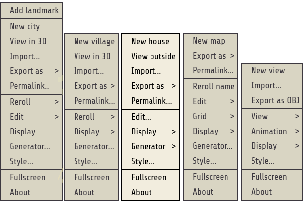
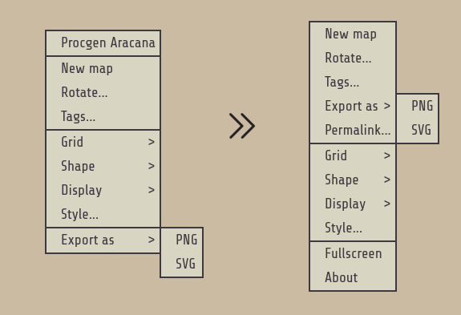
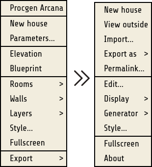
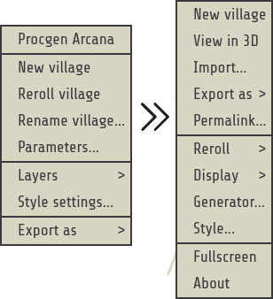
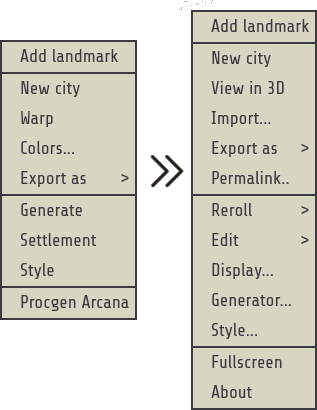
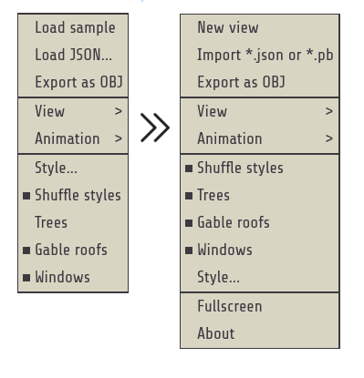
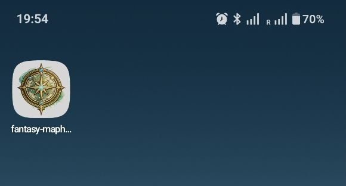
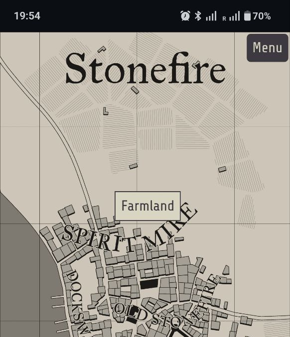

# Fantasy MapHub Generators

[Go to Russian version](./README.RU.md)

## Technical details

### Build and deployment

To build, run `npm run build` — the project will be built into the `dist` folder.

To make it available locally in your browser, run `npm run preview`.

For deployment on a server, copy the contents of the `dist` folder to the web root.

### Other notes

This project is built from predefined values and page templates; to make changes, it’s enough to work with these files:

- [package.json](./package.json)
- [static.config.mjs](./static.config.mjs)
- [pages.config.mjs](./pages.config.mjs)

If needed, you can “cut out” only one specific generator — at the code level they are self-contained and independent of their neighbors.

Data handling follows a proto-first approach, while keeping support for older JSON export formats. If you plan to create your own solution using this generator, I recommend relying only on binary proto files, because JSON import/export is primarily focused on supporting older variants and the original watabou generators. Proto files, in turn, guarantee long-term support even if new functionality is added — old saved files will be supported in new versions without losing backward compatibility.

Import only works with the extended export format — older exported files (watabou export) won’t open for editing in MFCG, because those files don’t contain the fields required to restore a map for editing.

### Generating binary files

All binary files are generated from proto files located in the [protobuf](./protobuf) directory.

Import accepts both raw binary proto objects from root structures and objects wrapped in a typed envelope with CRC32.

The envelope follows a simple format: `|DataType uint32|{protobuf binary}|crc32IEEE({protobuf binary})`

Type identifiers are also defined in proto: [DataType](./protobuf/data/enum.proto)

Root structures:

- [GeoObj](./protobuf/data/geo/obj.proto)
- [DwellingsObj](./protobuf/data/dwellings/obj.proto)
- [PaletteMfcgObj](./protobuf/data/palette/mfcg.proto)
- [PaletteVillageObj](./protobuf/data/palette/village.proto)
- [PaletteDwellingsObj](./protobuf/data/palette/dwellings.proto)
- [PaletteViewerObj](./protobuf/data/palette/viewer.proto)
- [PaletteCaveObj](./protobuf/data/palette/cave.proto)
- [PaletteGladeObj](./protobuf/data/palette/glade.proto)

## About the project

This project brings together the map generators by [watabou](https://github.com/watabou/) that he published at [watabou.github.io](https://watabou.github.io). Not all of them are publicly available, and even what is available is written in a not-so-popular language.

I took the web version implemented in JS and made many changes to it.

The work is not finished yet; the final goal is to get a fully self-contained generator and editor that requires no external resources and can conveniently describe an entire world, from a high level (planet) down to a low level (houses, clearings, and caves).

### What was changed overall:

- These generators are now fully local. That is, they can work without the internet: all connections are internal, and the downloaded files are included in the project.
- Maximum automation has been implemented. You can conveniently assemble everything for your use case by interacting only with constructors and JSON parameters.
- `openapi.json` has been created for the generators; it’s available directly via RapiDoc.
- I changed the serialisation approach, making it proto-first.
- I added import/export to a binary file: pure protobuf (import for MFCG and Village only works with extended export files, because the standard ones aren’t enough to restore a map for editing). Backward compatibility is preserved.
- Context menus have been standardised so that items across generators are in the same places and have the same names. Groups were reorganised to improve the UI as much as possible. Functionality was also added for generators that didn’t have it (`Permalink...`, `Fullscreen`).
- I added the ability to open cities and villages directly in the 3D viewer (`View in 3D`).
- Dialogs have been made more user-friendly (for example, it now clearly reports what the issue is during import). Loading indicators were also added for heavy operations such as PNG export.
- I added prefixes for exported files (`*.palette.mf.json`, `*.mf.json`) so it’s clear what relates to what without looking inside.
- Many small edge-case bugs were fixed.
- New functionality was added (mouse-wheel handling in MFCG and Dwellings, and an advanced ruler for MFCG).
- I published it as a separate [web resource](https://maphub.webtools.download), including a [PWA](https://en.wikipedia.org/wiki/Progressive_web_app), which makes it possible to install it as an app that doesn’t need the internet.

### Plans for the future:

- ~~Move palette import/export to proto.~~
- Add export for Cave/Glade Generator.
- ~~Add the ability to import schemes from a file for all generators except City Viewer (since City Viewer already has import).~~
- Add a 3D visualizer for buildings (separate or just extend City Viewer functionality).
- ~~Add an advanced export mode that transfers names, labels, and other fields.~~
- Add generation of Cave/Glade pointers in Medieval-Fantasy-City/Village Generator.
- After advanced export, it will be possible to link Cave/Glade/Dwellings Generator and Medieval-Fantasy-City/Village Generator.
- Make it separately buildable or extend the current build with a list of saved maps and palettes directly in the app.

## Gallery

### All context menus in one image

### How the context menu changed

#### Cave/Glade Generator

#### Dwellings Generator

#### Village Generator

#### Medieval-Fantasy-City Generator

#### City Viewer

### Example of an installed app

#### Installed on a phone: a separate icon, works even without the internet

#### Example of working without the internet

## CONTRIBUTING

If you want to join or just fix a bug — send a pull request with a description.

## LICENSE

The source code is published under MPL-2.0.

Contact email: [mail@sunsung.fun](mailto:mail@sunsung.fun).
